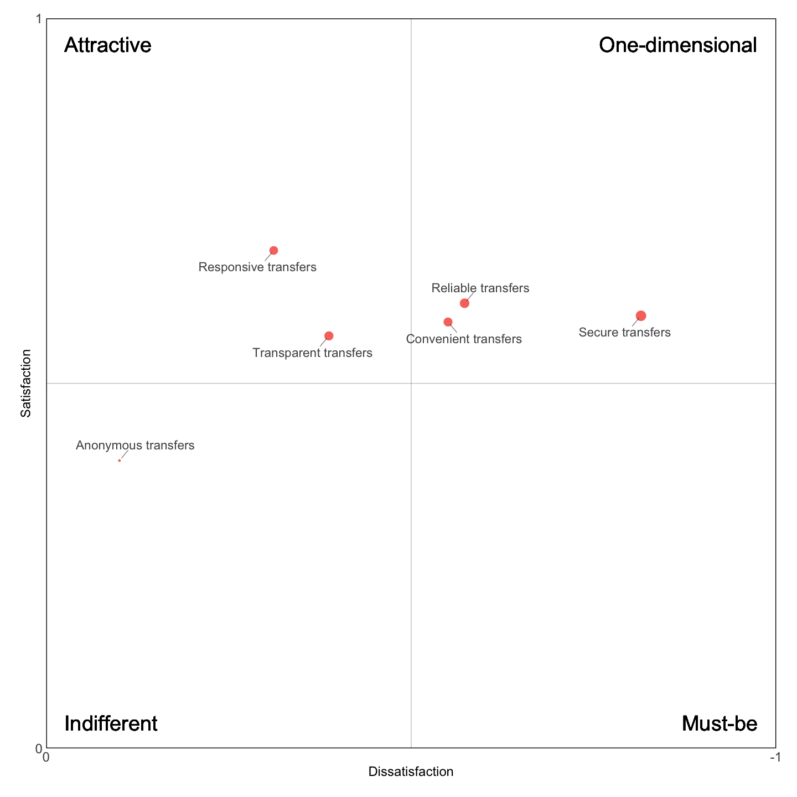

Doing Research Online: The Kano Model
================
Alex Reppel
07 February 2022

The [Kano model](https://en.wikipedia.org/wiki/Kano_model) is a theory
and accompanying methodology to evaluate how consumers perceive the
quality of product or service attributes. Results are typically
visualised in what is often referred to as a “Kano graph”. The aim of
this project is to generate such a graph in
[R](https:///www.r-project.org/).

Below is an example of a *Kano graph*, which helps to distinguish
different product or service attribute alongside two dimensions, namely
their potential to satisfy consumers or to lead to dissatisfaction.


Specific objectives for this project were:

1.  To demonstrate a flexible way of creating Kano graphs in `R`
2.  To minimise the use of external `R` packages
3.  To document the process for reproducibility

This project is organised as follows. [Section
1](#kanos-theory-of-attractive-quality) introduces [Kano’s theory of
attractive quality](https://en.wikipedia.org/wiki/Kano_model) and the
methodology associated with it. [Section 2](#survey-data) details the
process of loading and cleaning survey data, and outlines the
requirements you have to follow if you want to use your own data.
[Section 3](#calculations) describes the calculations required to
transform survey data so that it can be visualised in a Kano graph.
[Section 4](#the-kano-graph) describes the process of producing a Kano
graph.

This documents concludes with a brief [summary](#summary) of future
improvements.

Before describing the [Kano
model](https://en.wikipedia.org/wiki/Kano_model) in more detail, I would
like to begin with a short example.

# Example

This is, in fact, the example that, when it was told to me now more than
twenty years ago, convinced me that the *Kano model*[^1] is both a
useful and practical way of incorporating the view of users into the
product development process.

 *(Photo by
<a href="https://unsplash.com/@therook?utm_source=unsplash&utm_medium=referral&utm_content=creditCopyText">Chris
Haws</a> on
<a href="https://unsplash.com/s/photos/80s-car?utm_source=unsplash&utm_medium=referral&utm_content=creditCopyText">Unsplash</a>.)*

The example I would like to tell you about is from the car industry.
Specifically, it is the noise a car door makes when we close it. These
days, most car doors close almost silently of course, but those who ever
sat in a car from the late 1970s or early 1980s, that is the time the
*Kano model* was first developed, will appreciate that, back then, car
doors typically did not close silently. The opposite in fact. They would
make all sorts of noises.

 *(Photo by
<a href="https://unsplash.com/@markusspiske?utm_source=unsplash&utm_medium=referral&utm_content=creditCopyText">Markus
Spiske</a> on
<a href="https://unsplash.com/s/photos/car-door?utm_source=unsplash&utm_medium=referral&utm_content=creditCopyText">Unsplash</a>.)*

Because it was common for a car door not to close silently, this did not
surprise users. It’s what they expected. In other words, it constituted
the status-quo at the time. Nowadays, of course, many of us would
probably not be pleased (or even worried) when the doors of our cars
make all sorts of noticeable noises.

Seen through the lens of the *Kano model*, a car door that closes
silently would have had the potential to satisfy customers, while the
absence of it, that is, a car door that does not close silently, would
not have caused dissatisfaction because it was what most consumers would
expect.

This example illustrates an important observation on which the Kano
model is based, namely that “satisfaction” and “dissatisfaction” are not
necessarily opposites along a continuum. Instead, satisfaction is a
multidimensional concept where the opposite of a customer being
satisfied is for them *not* to be satisfied rather than being
dissatisfied (and vice versa).

The observation that customer “satisfaction” and customer
“dissatisfaction” are not necessarily opposites led [Noriaki
Kano](https://en.wikipedia.org/wiki/Noriaki_Kano) and colleagues to
develop a theory of customer satisfaction (Kano et al. 1984; Berger et
al. 1993), or rather a [Theory of Attractive
Quality](#kanos-theory-of-attractive-quality).

# Kano’s Theory of Attractive Quality

What is now commonly referred to as the [Kano
model](https://en.wikipedia.org/wiki/Kano_model) is a theory and
accompanying methodology to operationalise it (Löfgren and Witell 2008,
59). Here, multidimensionality refers to the distinction between
*satisfaction* and *dissatisfaction* caused by product or service
attributes on the one hand, and, on the other hand, the degree with
which these attributes were *implemented*. This makes it possible to
distinguish different quality categories for product or service
attributes (Löfgren and Witell 2008; Kano et al. 1984), such as:

1.  **Attractive** quality attributes that cause mainly satisfaction,
    but do not necessarily result in dissatisfaction when not
    implemented
2.  **One-dimensional** quality attributes that cause either
    satisfaction or dissatisfaction depending on how well they are
    implemented
3.  **Must-be** quality attributes that cause predominantly
    dissatisfaction, but may not necessarily result in satisfaction when
    implemented
4.  **Indifferent** quality attributes that cause neither meaningful
    satisfaction nor dissatisfaction

This is commonly illustrated with a **Kano diagram** with dimension 1
being *customer satisfaction* and dimension 2 the *degree with which an
attribute was implemented* or, alternatively, “the level of
Functionality” (Zacarias 2020) it provides (see, e.g, Berger et al.
1993, 9; Löfgren and Witell 2008, 62; Witell and Löfgren 2007, 56; Lee
and Newcomb 1997, 97).

While *Kano diagrams* can vary, newer versions tend to refer to “needs”
instead of “quality attributes”. This is because, first, it emphasises a
consumer perspective; and, second, because it recognises that consumers
change their evaluation of product or service attributes over time.
Going back once again to the initial example of a car door that closes
without making a noise, this product feature, while perhaps exiting four
decades ago, is now what most consumers would expect from their car.

This dynamic is further illustrated in the following interpretation of a
*Kano diagram* taken from [Wikimedia
Commons](https://commons.wikimedia.org/wiki/File:Kano_model_showing_transition_over_time.png).
Here, the two big red arrows illustrate how customer expectations
increase over time. What was previously considered *attractive* quality
with the potential to delight customers becomes, over time, a *must-be*
(or “essential”) requirement to satisfy what has since developed into a
basic need.[^2]


*(Description of how attributes values change over time in the Kano
model. (Source:
[Craigwbrown/Wikipedia](https://commons.wikimedia.org/wiki/File:Kano_model_showing_transition_over_time.png).))*

The terminology used in this illustration is an example of taking the
perspective of consumers rather than developers:

1.  **Attractive** quality attributes become **delighters**
2.  **One-dimensional** quality attributes fulfil **performance** needs
3.  **Must-be** quality attributes fulfil **basic** needs

It was said earlier that the [Kano
model](https://en.wikipedia.org/wiki/Kano_model) is both a theory and a
methodology to operationalise that theory (Löfgren and Witell 2008). An
important element of that methodology is the assumption that the way
consumers feel about a particular product or service attribute can be
measured (Zacarias 2020). If that were not possible, it would obviously
be quite difficult to operationalise this theory.

But how are consumer sentiments measured in a Kano study?

This is done through a **Kano questionnaire**, which uses a standardised
format to measure each product or service attribute with a question
pair:[^3]

1.  The **functional** (or *positive*) question measures how respondents
    feel if an attribute is present
2.  The **dysfunctional** (or *negative*) question measures how
    respondents feel if the attribute is *not* present

 *(Example of a question pair
measuring a single attribute. (Source: Berger et al. 1993, 6.))*

Beside question pairs, *Kano questionnaires* also use standard answer
options. In early studies, these were often the English translation of
Kano et al. (1984)’s original Japanese answer options (see Berger et al.
1993). However, in their wide-ranging (and very instructive) discussion
of both theoretical and practical considerations when designing *Kano
questionnaires*, Berger et al. (1993) discuss a number of different
answer sets (pp. 25-7), three of which are shown below.

 *(Different answer
sets used in Kano questionnaires. (Source: Adapted from Berger et al.
1993, 25–27.))*

They conclude that the choice of answer sets matters, which means that
results may change depending on how answer options are worded. For
example, Nilsson‐Witell and Fundin (2005) compared two different answer
sets and report that the percentage of results indicating that
respondents may not have fully understood a question pair, vary between
2% and 6%. These results underline the importance of sticking to one set
of answer options, which nowadays very often means using the one shown
on the right in the table above.

Results from a *Kano questionnaire* are then analysed using what is
known as the **Kano evaluation table** (e.g., Berger et al. 1993, 6). In
this table, answers from each respondent to a single question pair, that
is to the *functional* (positive) and *dysfunctional* (negative)
question, are compared to classify the corresponding attribute or
feature for that respondent.

Attributes are thus classified following the quality categories we’ve
seen before:

1.  Attractive (`A`)
2.  One-dimensional (`O`)
3.  Must-be (`M`)
4.  Indifferent (`I`)

In addition to these four categories, attributes may also be classified
as either **reverse** (`R`) or **questionable** (`Q`). *Reverse* (`R`)
quality attributes are those that cause dissatisfaction when fully
implemented and satisfaction when not, and *questionable* (`Q`) category
indicates that respondents may have found it difficult to classify an
attribute (Nilsson‐Witell and Fundin 2005, 161) and/or may have
misunderstood the questions (Löfgren and Witell 2008, 62).

 *(Example of a Kano
evaluation table. (Source: Berger et al. 1993, 6.))*

In the traditional evaluation table, only the two extreme positions are
coded as questionable (`Q`). A modified evaluation table is described by
Fred Pouliot in Berger et al. (1993, 33), who argues that a response
should always be classified as *questionable* (`Q`) when the same answer
is given to both parts of a question pair, except, of course, when a
respondent is “neutral” either way. Pouliot’s suggestion makes sense as
it is difficult to see how a respondent can state that they “expect” an
attribute to be simultaneously present and absent, although I am
personally less confident that it also applies to the answer option
where respondents can “tolerate” an attribute to be simultaneously
present and absent.

This is an area that does require agreement by the development team,
although not necessarily at the start of a Kano study as the way results
are analysed can be adjusted even after data has been collected.

A particular appeal of the *Kano model*, especially for beginners, is
the clear visual presentation of theoretical assumptions and methodology
shown in the *Kano diagram*, the *Kano questionnaire*, and the
*evaluation table*. In fact, it is quite common to illustrate the
methodology as a three-step process that you see here, ranging from
*questionnaire* to *evaluation table* to the *tabulation of results*
(e.g., Berger et al. 1993, 6; Witell and Löfgren 2007, 59; Löfgren and
Witell 2008, 61):

 *(Kano methodology: Example of
the steps involved in classifying data from a Kano questionnaire.
(Source: Berger et al. 1993, 6.))*

Another appeal of the *Kano model* is the so-called **Kano graph**,
which is often used to communicate and discuss results from a Kano study
with members of the development team, but also with external
stakeholders.

This leaves us with the question of how tabulated results are converted
into such a *graph*? For this, we position each product or service
attribute (what I tend to call a “feature”) alongside the two dimensions
of a *Kano graph*: The **level of satisfaction** (ranging from `0` to
`1`) and **level of dissatisfaction** (ranging from `0` to `-1`).

Traditionally, this is done by calculating what is now commonly referred
to as the “satisfaction coefficient” and “dissatisfaction coefficient”
in the form of $\frac{A + O}{A + O + M + I}$ for “satisfaction” and
$-\frac{O + M}{A + O + M + I}$ for “dissatisfaction” (see, e.g., Berger
et al. 1993, 18).

For example, dividing the sum of all responses that classify an
attribute as either *attractive* (`A`) or *one-dimensional* (`O`) over
the sum of all responses (excluding *reverse* and *questionable*
responses) results in the *satisfaction coefficient*. Because the
*satisfaction coefficient* for an attribute ranges from `0` to `1`, it
can thus be plotted on the y-axis. Similarly, the *dissatisfaction
coefficient* determines an attribute’s location on the x-axis.

Applied to all attributes across a data set results in a graph such as
this.


Analysing and visualising data from a *Kano questionnaire* can be
achieved in a number of ways, such as with a spreadsheet for example.
Personally, I prefer using [R](https://www.r-project.org/) instead,
which I find both flexible and easy to adjust if necessary. For the
remainder of this document, I will walk you through the steps I take to
analyse and visualise data from a *Kano questionnaire*.

# Survey data

First, we need a dataset that adheres to the requirements of a *Kano
questionnaire*. As we will see further below, this script makes a couple
of assumptions on how the data is formatted. Let’s begin with some
preparatory steps.

## Preparation

Beside collecting question pairs, it is now common to also include a
question about perceived importance into a *Kano questionnaire*. The two
most important preparatory steps are to convert the answers to question
pairs and those for importance into a format that can be used for
further processing. In other words, we have to convert text answers into
numerical values.

### Importance

The importance of product or service attributes has to be recorded in a
specific way: a 9-point [Likert
scale](https://en.wikipedia.org/wiki/Likert_scale). For the script to
process that data, it is necessary that answer options in the survey
exactly match those given the list `IMPORTANCE`, which are then
converted into numerical values ranging from `1` to the length of the
list (`9`).

``` r
IMPORTANCE <- c(
  "1 - Not at all important",
  "2",
  "3 - Somewhat important",
  "4",
  "5 - Important",
  "6",
  "7 - Very important",
  "8",
  "9 - Extremely important")
```

### Standardised answer options

It was stated earlier that *Kano questionnaires* differ in the standard
answer option they offer.

For this script to process them, it is necessary that answer options
that are used in a survey match exactly those the script can understand.
In other words, they have to match the permitted answer options listed
in the variable `ANSWERS`.

Each list in `ANSWERS` contains options for one of the five standardised
answers choices. Over the years, authors have experimented with a number
of different answer options (e.g., Nilsson‐Witell and Fundin 2005) and
this script currently recognises the four sets of standardised answer
choices discussed in Berger et al. (1993, 25–26).

``` r
ANSWERS <- list(
  A = c("I like it that way",
        "I enjoy it that way",
        "This would be very helpful to me",
        "I like it"),
  B = c("I must be that way",
        "It is a basic necessity or I expect it that way",
        "This is a basic requirement for me",
        "I expect it"),
  C = c("I am neutral",
        "I am neutral",
        "This would not affect me",
        "I’m neutral"),
  D = c("I can live with it that way",
        "I dislike it, but I can live with it that way",
        "This would be a minor inconvenience",
        "I can tolerate it"),
  E = c("I dislike it that way", 
        "I dislike it, and I can’t accept it",
        "This would be a major problem for me",
        "I dislike it")
  )
```

## Using your own survey data

*Kano questionnaires* follow a particular structure, which means that it
is won’t be possible to produce a graph from any arbitrary survey data.

While basic versions of the questionnaire state only two questions per
attribute (the standard pairs consisting of `functional` and
`dysfunctional` questions), it is assumed here that the data set
includes responses to a third question, which is the `importance` of an
attribute.

Moreover, to simplify the structure of the survey, attributes are
distinguished by an `ID` number instead of a name or label. Because
using `ID`s would not make for an informative graph, additional
information for each attribute has to be collected in a separate file
(called `features.csv`, see below).

If you wish to use your own data to create a *Kano graph*, it is
therefore necessary to prepare at least two
[CSV](https://en.wikipedia.org/wiki/Comma-separated_values) files and
store them where the script can find them (it is assumed that they are
stored in a sub-directory with the path `assets/data/`):

1.  A `features.csv` file with descriptions of each attribute
    (features). At a minimum, this file consists of three columns:
    1.  The feature `ID` in the format of `F#_` with `#` stating the
        number of that feature (e.g., `F1_`)
    2.  The feature `Label`
    3.  The `Category` this feature is part of
2.  At least one CSV file ending on `-clean.csv` with responses from
    participants. At a minimum, this file consists of an `ID` column
    (storing the unique ID of each response) and three columns for
    *each* attribute (feature):
    1.  The `Importance` for each feature (e.g., `F1_Importance` for the
        first feature).
    2.  Results for the `Functional` question for a feature (e.g.,
        `F1_Functional` for the first feature).
    3.  Results for the `Dysfunctional` question for a feature (e.g.,
        `F1_Dysfunctional` for the first feature).

In the script, information from both files are linked using a feature’s
unique `ID` from the `features.csv` file. For example, in a [Kano
graph](#the-kano-graph), the `Label` for feature `ID` “F1\_” (in
`features.csv`) will be used as the label for plotting that feature in
the graph.

## Loading data

We begin by locating all the files stored in the data directory that
match our criteria. For this demonstration, I have stored a number of
CSV files in the `assets/data/` directory. The following command
collects all file names in that directory ending in `-clean` and stores
them in a variable called `files`.

``` r
files <- Sys.glob("assets/data/*-clean.csv")
```

*(I limit file names to those ending in `-clean.csv` to ensure that I do
not accidentally read the original survey files, but those that have
been “cleaned” of any possible personal information.)*

The content of the first file in the list is used to initialise a data
frame called `SURVEY_RESULTS`. If more than one file was stored in the
`assets/data/` directory, their content is merged into the
`SURVEY_RESULTS` data frame.

It is important to note that this only works reliably if the various
files either contain responses from different participants or responses
to different questions by the same participants (which are then merged
by the value of the `ID` column). *(A limitation of the current approach
is that it does not work if files contain responses to the same
questions from the same respondents, but at different times.)*

``` r
last_file <- tail(files, n = 1)
SURVEY_RESULTS <- read.csv(last_file, header = TRUE)
```

## Cleaning data

A few more steps are required before the `SURVEY_RESULTS` data frame can
be processed further. Our data frame holds information on each features,
but not all of it is necessary to create a KANO graph. The information
that we do need for each feature is the `importance` score and answers
to the `functional` (positive) and `dysfunctional` (negative) KANO
questions.

While we can ignore the additional data stored in `SURVEY_RESULTS`, the
data we need is not yet accessible in the right format. This means that
the data has to be cleaned.

First, we classify all empty cells as `NA` to let `R` know that no data
available in this particular instance.

``` r
SURVEY_RESULTS[SURVEY_RESULTS == ""] <- NA
```

We then adjust values for the importance each respondent has assigned to
each of the features. Earlier, we created a list called `IMPORTANCE`
that contains the possible values:

- “1 - Not at all important”
- “2”
- “3”
- “4”
- “5”
- “6”
- “7”
- “8”
- “9 - Extremely Important”

If we want to calculate the average importance across all respondents,
we have to replace each answer with a numeric value. This is easily done
by looping over the elements in the list `IMPORTANCE` and replace each
occurrence in the `SURVEY_RESULTS` data frame with the corresponding
numeric value (which, conveniently enough, corresponds with the position
each element has in the list).

``` r
for (counter in 1:length(IMPORTANCE)) {
    SURVEY_RESULTS[SURVEY_RESULTS == IMPORTANCE[counter]] <- counter
}
```

We also need answers to the `functional` and `dysfunctional` KANO
questions as numeric values. These can be converted in the same way as
before.

Earlier, a list called `ANSWERS` was initialised that contains list of
answer options. Each list in `ANSWERS` contains answer options for one
of the five standardised answers choices.

``` r
for (counter in 1:length(ANSWERS)) {
  for (answer in ANSWERS[[counter]]) {
    SURVEY_RESULTS[SURVEY_RESULTS == answer] <- counter
  }
}
```

## Labelling features

At one point, we want to give each feature a name and assign it to a
category.

Descriptions for each feature are stored in a separate file, which we
read into a data frame called `features`.

We can have a quick look into these descriptions and see that we have a
`Label` and a `Category` assigned to each feature `ID`.

    ##      ID                 Label  Category
    ## 6   F6_   Anonymous transfers Transfers
    ## 7   F7_  Convenient transfers Transfers
    ## 8   F8_    Reliable transfers Transfers
    ## 9   F9_  Responsive transfers Transfers
    ## 10 F10_      Secure transfers Transfers
    ## 11 F11_ Transparent transfers Transfers
    ##                                                                                              Question
    ## 6    If you can transfer funds without having to link that transaction to your name, how do you feel?
    ## 7                                                   If it is easy to transfer funds, how do you feel?
    ## 8                     If you can transfer your funds wherever and whenever you want, how do you feel?
    ## 9                                     If funds are transferred almost instantaneous, how do you feel?
    ## 10 If it is guaranteed that no one else can manipulate transfers you have initiated, how do you feel?
    ## 11          If relevant information on how to make transfers is always easy to find, how do you feel?

These attributes will later be used to give each feature a proper label
and assign it to a category. `ID`, `Label`, and `Category` information
for a given `feature` are extracted from the `features` data frame using
the `get_feature_info` helper function. .

``` r
get_feature_info <- function(category) {
  FEATURES <- read.csv("assets/data/features.csv")
  if (category == "labels") {
    l <- FEATURES$Label
    }
  if (category == "categories") {
    l <- FEATURES$Category
    }
  names(l) <- FEATURES$ID
  return(l)
  }
```

## Evaluating the dataset

We can confirm that these data cleaning steps were successful by looking
at a couple of rows in our `SURVEY_RESULTS` data frame.

``` r
tail(SURVEY_RESULTS)
```

    ##           ID            Income_us Gender Age         Employment
    ## 353 ALL1-358       15000_to_24999 female  34 employed_full_time
    ## 354 ALL1-359     150000_to_249999   male  32 employed_full_time
    ## 355 ALL1-360         less_than_15 female  21      self_employed
    ## 356 ALL1-361       50000_to_74999 female  35          homemaker
    ## 357 ALL1-362 prefer_not_to_answer   male  21  student_full_time
    ## 358 ALL1-363 prefer_not_to_answer   male  19  student_full_time
    ##                           Education F6_importance F7_importance F8_importance
    ## 353                 college_diploma             7             5             5
    ## 354 university_undergraduate_degree             5             7             6
    ## 355       high_school_or_equivalent             3             3             7
    ## 356       high_school_or_equivalent             6             7             7
    ## 357       high_school_or_equivalent             5             7             8
    ## 358        some_high_school_or_less             7             9             9
    ##     F9_importance F10_importance F11_importance F6_functional F6_dysfunctional
    ## 353             5              5              7             1                5
    ## 354             4              7              6             1                5
    ## 355             7              9              7             3                3
    ## 356             9              9              7             2                3
    ## 357             8              8              8             3                2
    ## 358             5              9              5             1                2
    ##     F7_functional F7_dysfunctional F8_functional F8_dysfunctional F9_functional
    ## 353             1                5             1                4             1
    ## 354             2                4             1                4             1
    ## 355             3                3             3                3             3
    ## 356             1                5             1                5             1
    ## 357             1                5             1                5             1
    ## 358             2                4             1                2             1
    ##     F9_dysfunctional F10_dysfunctional F10_functional F11_functional
    ## 353                4                 5              1              1
    ## 354                5                 5              1              2
    ## 355                3                 3              3              3
    ## 356                5                 5              1              1
    ## 357                4                 5              1              1
    ## 358                2                 5              2              1
    ##     F11_dysfunctional
    ## 353                 4
    ## 354                 3
    ## 355                 3
    ## 356                 5
    ## 357                 5
    ## 358                 2

We now have a clean dataset of our survey data and can begin the
necessary calculations to prepare our data to be plotted into a *Kano
graph*.

# Calculations

While the calculations required by the *Kano method* are not
complicated, they do require a couple of steps that, when expressed in
code, may look more complicated than they actually are.

First, we initiate a further data frame called `KANO` to store the
results of our calculations. Data stored in the `KANO` data frame will
subsequently be used to generate the *Kano graph*.

## Initialising the data frame

For each attribute (feature), the `KANO` data frame stores the following
variables:

1.  The `Label` of the feature
2.  The `Category` it belongs to
3.  The `Importance` score across all respondents
4.  The number of responses for each of the six KANO categories (`A`,
    `O`, `M`, `I`, `R`, and `Q`)
5.  The `Total` number of responses for this feature
6.  The overall KANO `Classification` *(based on the values for the six
    categories above)*
7.  The average `Satisfaction` and `Dissatisfaction` scores

``` r
initialise_Kano_df <- function() {
  return(data.frame(
    Label = character(),
    Category = character(),
    Importance = integer(),
    A = integer(),
    O = integer(),
    M = integer(),
    I = integer(),
    R = integer(),
    Q = integer(),
    Total = integer(),
    Classification = character(),
    Satisfaction = integer(),
    Dissatisfaction = integer()                   
  ))
}
```

## Helper functions

It is the next step that may make the *Kano method* look more
complicated than it actually is. We will use the following helper
functions to complete the necessary calculations, and to subsequently
store results in the `KANO` data frame.

The four helper functions are:

1.  [Evaluation table](#evaluation-table)
2.  [Classification](#classification)
3.  [Satisfaction coefficient](#satisfaction-coefficient)
4.  [Dissatisfaction coefficient](#dissatisfaction-coefficient)

### Evaluation table

The `KANO_evaluation` function returns the KANO category (`A`, `O`, `M`,
`I`, `R`, or `Q`) for a single response. The function takes as input two
values from each respondent (i.e., each row in `SURVEY_RESULTS`) and
applies the modified version of the Kano evaluation table described by
Pouliot in Berger et al. (1993, 33).

Evaluated are question pairs: The first part is the answer to the
`functional` question and the second part is the answer the same
respondent gave to the `dysfunctional` question.

``` r
KANO_evalution <- function(f, d) {
    if (is.na(f) | is.na(d)) {
        return(NA)
    }
    if (f == 1 && d == 1){
        return("Q")  # Questionable result
    }
    if (f == 1 && d %in% c(2,3,4)){
        return("A")  # Attractive
    }
    if (f == 1 && d == 5){
        return("O")  # One-dimensional
    }
    if (f %in% c(2,3,4,5) && d == 1){
        return("R")  # Reversed
    }
    if (f == 2 && d == 2){
        return("Q")  # Questionable result
    }    
    if (f %in% c(3,4) && d %in% c(2,3)){
        return("I")  # Indifferent
    }
    if (f %in% c(2,3) && d %in% c(3,4)){
        return("I")  # Indifferent
    }
    if (f == 4 && d == 4){
        return("Q")  # Questionable result
    }  
    if (f %in% c(2,3,4) && d == 5){
        return("M")  # Must-be
    }
    if (f == 5 && d %in% c(1,2,3,4)){
        return("R")  # Reversed
    }
    if (f == 5 && d == 5){
        return("Q")  # Questionable result
    }
}
```

### Classification

The `KANO_classification` function returns the overall classification
(`A`, `O`, `M`, `I`, `R`, or `Q`) for a feature across all responses.

The function takes as input a table with the sum of how often an
attribute (feature) has been classified by respondents as either `A`,
`O`, `M`, `I`, `R`, or `Q`. In the table, classifications are used as
labels with values being the number of times a feature was classified as
one of those categories by respondents.

Note that this function uses what Zacarias (2020) refers to as the
(traditional) “discreet” approach of analysing results from a *Kano
questionnaire*, in contrast to their preferred “continuous” analysis, an
approach described by William DuMouchel in Berger et al. (1993, 20–23).

``` r
KANO_classification <- function(t) {
    if ("A" %in% names(t)) {
        a <- t["A"]
    } else {
        a <- 0
    }
    if ("O" %in% names(t)) {
        o <- t["O"]        
    } else {
        o <- 0
    }
    if ("M" %in% names(t)) {
        m <- t["M"]        
    } else {
        m <- 0
    }
    if ("I" %in% names(t)) {
        i <- t["I"]        
    } else {
        i <- 0
    }
    if ("R" %in% names(t)) {
        r <- t["R"]        
    } else {
        r <- 0
    }
    if ("Q" %in% names(t)) {
        q <- t["Q"]        
    } else {
        q <- 0
    }
    oam <- c(o, a, m)
    irq <- c(i, r, q)
    if (sum(oam) > sum(irq)) {
        max <- max(oam)
        if (max == m) {
            return("M")
        }
        if (max == o) {
            return("O")
        }
        if (max == a) {
            return("A")
        }
    } else {
        max <- max(irq)
        if (max == i) {
            return("I")
        }
        if (max == r) {
            return("R")
        }
        if (max == q) {
            return("Q")
        }
    }
}
```

### Satisfaction coefficient

The `KANO_satisfaction` function returns what is now commonly referred
to as the *satisfaction coefficient*, which is calculated as
$\frac{A + O}{A + O + M + I}$ with each letter being the number of times
a feature was classified as the corresponding category (`A`, `O`, `M`,
`I`, `R`, or `Q`).

The function takes as input a table with the categories `A`, `O`, `M`,
`I`, `R`, or `Q` as labels with values being the number of times a
feature was classified as one of those categories.

``` r
KANO_satisfaction <- function(t) {
    a <- t["A"]
    if (is.na(a)) { a <- 0}
    o <- t["O"]
    if (is.na(o)) { o <- 0}
    m <- t["M"]
    if (is.na(m)) { m <- 0}
    i <- t["I"]
    if (is.na(i)) { i <- 0}
    r <- t["R"]
    if (is.na(r)) { r <- 0}
    q <- t["Q"]
    if (is.na(q)) { q <- 0}
    return((a + o) / (a + o + m + i))
}
```

### Dissatisfaction coefficient

The `KANO_dissatisfaction` function returns what is now commonly
referred to as the *dissatisfaction coefficient*, which is calculated as
$-\frac{O + M}{A + O + M + I}$ with each letter being the number of
times a feature was classified as the corresponding category (`A`, `O`,
`M`, `I`, `R`, or `Q`).

The function takes as input a table with the categories `A`, `O`, `M`,
`I`, `R`, or `Q` as labels with values being the number of times a
feature was classified as one of those categories.

``` r
KANO_dissatisfaction <- function(t) {
    a <- t["A"]
    if (is.na(a)) { a <- 0}
    o <- t["O"]
    if (is.na(o)) { o <- 0}
    m <- t["M"]
    if (is.na(m)) { m <- 0}
    i <- t["I"]
    if (is.na(i)) { i <- 0}
    r <- t["R"]
    if (is.na(r)) { r <- 0}
    q <- t["Q"]
    if (is.na(q)) { q <- 0}
    return(-(o + m) / (a + o + m + i))
}
```

With the help of these functions, we can now begin to populate the
`KANO` data frame created earlier.

Well, not quite …

There is one more step to complete before we can populate the `KANO`
data frame.

## Preparing the data frame

This last step is to add columns to the original `SURVEY_RESULTS` data
frame where we can store the result from those calculations that will
later be used to populate the `KANO` data frame.

The “[evaluation table](#evaluation-table)” function is called for each
feature (or `row` in the listing below). Results are stored in the
existing `SURVEY_RESULTS` data frame as a new column.

``` r
get_all_features <- function(df){
  all_features <- list()
  for (i in 1:length(df)) {
    feature <- sprintf('F%s_', i)
    if (length(colnames(df[grepl(
      feature, colnames(df))]))) {
      all_features <- append(all_features, feature) 
    }
  }
  return(all_features)
}
```

``` r
populate_survey_df <- function(df) {
  for (i in 1:length(df)) {
    feature <- sprintf('F%s_', i)
    if (length(colnames(df[grepl(
      feature, colnames(df))]))) {
      functional <- sprintf('%sfunctional', feature)
      dysfunctional <- sprintf('%sdysfunctional', feature)
      evaluation <- sprintf('%sevaluation', feature)
      t <- c()
      for (row in 1:nrow(df)) {
        t <- append(t, KANO_evalution(
          df[functional][row, 1],
          df[dysfunctional][row, 1]))
        }
      df[evaluation] <- t
    }
  }
  return(df)
  }
```

``` r
SURVEY_RESULTS <- populate_survey_df(SURVEY_RESULTS)
```

Now we have everything we need to populate the `KANO` data frame!

## Populating the data frame

The following code loops through the list of attributes (features),
makes the necessary calculations, and adds results to the `KANO` data
frame created earlier.

``` r
populate_Kano_df <- function(df){
  features <- get_all_features(df)
  Kano <- initialise_Kano_df()
  for (i in 1:length(features)) {
    feature_number <- features[[i]]
    feature_labels <- get_feature_info("labels")
    feature <- feature_labels[feature_number]
    category_labels <- get_feature_info("categories")
    category <- as.character(category_labels[feature_number])
    importance_label <- sprintf('%simportance', feature_number)
    importance <- mean(as.numeric(df[[importance_label]]), na.rm = TRUE)
    column_label <- sprintf('%sevaluation', feature_number)
    t <- table(df[column_label])
    classification <- KANO_classification(t)
    dissatisfaction <- KANO_dissatisfaction(t)
    satisfaction <- KANO_satisfaction(t)
    a <- t["A"]
    if (is.na(a)) { a <- 0}
    o <- t["O"]
    if (is.na(o)) { o <- 0}
    m <- t["M"]
    if (is.na(m)) { m <- 0}
    i <- t["I"]
    if (is.na(i)) { i <- 0}
    r <- t["R"]
    if (is.na(r)) { r <- 0}
    q <- t["Q"]
    if (is.na(q)) { q <- 0}
    total <- nrow(na.omit(df[column_label]))
    Kano[nrow(Kano) + 1,] <- list(
      feature,
      category,
      importance,
      a, o, m, i, r, q,
      total,
      classification,
      satisfaction,
      dissatisfaction)
  }
  return(Kano)
  }
```

We can confirm this by looking at an excerpt of the `KANO` data frame.

    ##                   Label  Category Importance   A   O  M   I  R  Q Total
    ## 1   Anonymous transfers Transfers   5.089385  91  19  9 160 49 30   358
    ## 2  Convenient transfers Transfers   6.804469  70 121 59  77  9 22   358
    ## 3    Reliable transfers Transfers   7.125698  78 122 66  62  7 23   358
    ## 4  Responsive transfers Transfers   6.664804 145  76 25  78 12 22   358
    ## 5      Secure transfers Transfers   7.729050  18 174 90  42  7 27   358
    ## 6 Transparent transfers Transfers   6.865922  88  90 32 105 15 28   358
    ##   Classification Satisfaction Dissatisfaction
    ## 1              I    0.3942652      -0.1003584
    ## 2              O    0.5840979      -0.5504587
    ## 3              O    0.6097561      -0.5731707
    ## 4              A    0.6820988      -0.3117284
    ## 5              O    0.5925926      -0.8148148
    ## 6              O    0.5650794      -0.3873016

This is looking very good and we can proceed to plot the KANO graph.

# The Kano graph

Visualising responses in a *Kano graph* is perhaps the most intriguing
part of this project. We begin by plotting the `Satisfaction` and
`Dissatisfaction` scores that were calculated earlier for each
attribute.

## A first attempt

``` r
plot(x = KANO$Dissatisfaction,
     y = KANO$Satisfaction,
     xlab = "Dissatisfaction",
     ylab = "Satisfaction",
     xlim = c(0,-1),
     ylim = c(0,1)
     )
```

<!-- -->

While this is a start, it doesn’t look particularly nice. Let’s move
swiftly on and use the power of what is perhaps one of the most widely
used [R](https://www.r-project.org/) packages available: `ggplot2`
(Wickham 2016).

In fact, to meaningfully enhance the basic graph above, we have to
install two external `R` packages. The first is `ggplot2`, which makes
it possible to create visualisations that tend to look better than base
[R](https://www.r-project.org). Although we won’t take advantage of most
of `ggplot2`’s functionality, the package makes the process of
customising visualisations very easy, which is why it has become my
default option of creating graphs in [R](https://www.r-project.org/).

In addition to `ggplot2`, we also have to install the `ggrepel` package
(Slowikowski 2021). This helps us avoid overlapping labels, which is
especially useful for projects assessing more than a handful of product
or service attributes (features).

``` r
require(ggplot2)
require(ggrepel)
# Arranging graphs
library(patchwork)
```

Creating a graph with `ggplot2` is very easy. All that is required is to
specify the data frame and the columns where it can find the data to
draw the x and y-axis respectively.

## The basic frame

In our case, the `Dissatisfaction` score for each feature will be shown
on the x-axis and the `Satisfaction` score shown on the y-axis.

``` r
plot <- ggplot(
    KANO,
    aes(Dissatisfaction,  # x-axis
        Satisfaction))    # y-axis
```

Looking at the output, we see … nothing!

<!-- -->

This is not surprising, because we haven’t told `ggplot2` which data to
plot onto the graph. In `ggplot2`, a graph consists of layers drawn on
top of each other. So far, we have only specified the what may be
thought of as the “base” graph (i.e., the x and y-axis), but not the
data we want to visualise.

Before we do that, it is useful to adjust the graph’s appearance. This
is easily done using `ggplot2`–all it takes is to adjust the values for
a couple of variables from the `theme()` function, such as the *aspect
ration* (which we want to be set to `1` so that both axis have the same
length), or the *background* colour (which we want to set to `white`).

``` r
plot <- plot +
    theme(aspect.ratio = 1,
          panel.background = element_rect(
              fill = "white",
              colour = "black",
              size = 1),
          plot.margin = margin(
              25, 25, 25, 25),
          axis.title = element_text(
              size = 18),
          axis.text = element_text(
              size = 18),
          panel.grid.major = element_blank(),
          panel.grid.minor = element_blank(),
          axis.ticks = element_blank(),
          legend.position = "none"  # "right"
          )
```

We already saw that *dissatisfaction* scores can only take values
between `-1` and `0` and we can limit the x-axis accordingly.
*Satisfaction* scores vary between `0` and `1`, which means that we can
limit the y-axis to that range.

It is also common to draw a horizontal and a vertical line to
distinguish the four “extreme” feature categories `attractive`,
`one-dimensional`, `indifferent`, and `must-be`.

``` r
plot <- plot +
    coord_cartesian(
      xlim = c(0, -1),
      ylim = c(0, 1)) + 
  scale_x_continuous(
    expand = c(0, 0),
    breaks = c(0, -1)) + 
  scale_y_continuous(
    expand = c(0, 0),
    breaks = c(0, 1))

plot <- plot +
    geom_hline(
        yintercept = 0.5, colour = "black", alpha = 0.25) +
    geom_vline(
        xintercept = -0.5, colour = "black", alpha = 0.25)
```

Using `ggplot2`’s `geom_text()` function, we can add a layer for each of
the main categories we’ll use to distinguish attributes, namely
`attractive`, `one-dimensional`, `indifferent`, and `must-be`.

``` r
plot <- plot +
    geom_text(
        aes(-0.025, 0.025, label="Indifferent"),
        size = 10, vjust = "inward", hjust = "inward") +
    geom_text(
        aes(-0.025, 0.975, label="Attractive"),
        size = 10, vjust = "inward", hjust = "inward") +    
    geom_text(
        aes(-0.975, 0.025, label="Must-be"),
        size = 10, vjust = "inward", hjust = "inward") +        
    geom_text(
        aes(-0.975, 0.975, label="One-dimensional"),
        size = 10, vjust = "inward", hjust = "inward")
```

The output looks a lot more like a typical *Kano graph*, albeit still
without any data plotted on it!

<!-- -->

## Adding data points

This is done using the `geom_point()` function. Each product or service
attribute (feature) will be represented by a circle (`point`), with the
two aesthetic attributes `size` and `colour` representing it’s
`Importance` and `Category` respectively.

``` r
plot <- plot +
    geom_point(
        aes(size = Importance,
            colour = Category)
        )
```

Finally, we have a graph showing each attribute from our survey
represented as circles!

<!-- -->

Although this is progress, we still don’t know which feature each circle
represents. While it is easy enough to add labels to the graph, this can
get messy quite quickly once we try to display more than a handful of
features, or when circles representing them fall in close proximity to
each other.

## Adding labels

The `ggrepel` package helps to avoid overlapping labels. This does not
work all the time, but for most intents and purposes, the package does a
very decent job.

``` r
plot <- plot +
    geom_text_repel(
        aes(label = Label),
        color = "black",
        size = 6,
        alpha = 0.75,
        segment.color = "black",
        segment.alpha = 0.5,
        point.padding = 0.5,
        min.segment.length = 0,
        box.padding = 1
        )
```

Sure enough, the final output looks quite good. Success!

<!-- -->

In reality, I would recommend using `geom_text_repel()` before
`geom_point()` so that points are placed above labels. As `ggplot2` adds
elements in layers, the line connecting points with the label text is
currently drawn above points, which isn’t always ideal, especially with
larger circles.

As such, a graph looks better when the layer containing labels is added
*before* the one containing points.

# Summary

In this project, I have walked you through one way of generating a *Kano
graph* in [R](https:///www.r-project.org/). This graph is perhaps the
most common form of communicating results from a study based on the
[Kano model](https://en.wikipedia.org/wiki/Kano_model), which is a
theory and accompanying methodology to evaluate how consumers perceive
the quality of product or service attributes.

Three objectives were formulated for this project: (a) to demonstrate a
flexible way of creating Kano graphs in `R`, (b) to minimise the use of
external `R` packages, and (c) to document the process for
reproducibility. I hope you agree with me that using
[R](https://www.r-project.org/) is a flexible way of creating *Kano
graphs*. Moreover, the project does rely on two external packages,
although for very good reason: It makes creating graphs a lot easier
compared to using base [R](https://www.r-project.org/). Finally, I have
tried to be as detailed as possible in documenting my process, but also
to provide some rationale for why I took certain steps.

While it is already possible to process data from any (standard) *Kano
questionnaire*, there are a number of improvements that I have thought
about while putting this document together, some of which I wasn’t able
to include in this first version.

Most of these improvements are either additional customisations or
extensions to the underlying logic of the methodology, and should be
considered in a future version.

1.  It may make the *Kano graph* easier to read when the axis labels and
    numbering are removed, or at least if the option to remove them
    exists. Whether or not this is a good idea probably depends on the
    audience for which the graph is generated. While some may wish to
    see axis labels (e.g., `Dissatisfaction`) and associated numbers
    (e.g., `0` to `-1`), others may be more interested in investigation
    the position of each attribute. What matters most to those audiences
    is perhaps whether an attribute is *clearly* positioned in a corner,
    thus suggesting considerable agreement exists amongst respondents,
    or located much more closely to the centre of the graph, thus
    suggesting that respondents don’t quite agree on how to classify
    this attribute.

In Berger et al. (1993, 20–23), William DuMouchel describes a number of
interesting additions to the way data from a *Kano questionnaire* is
analysed and visualised. (See Zacarias (2020) for a demonstration of
some of DuMouchel’s suggestions.) In its current form, this project only
considers one of those suggestions (the inclusion of average importance
per attribute), but several others should be considered in future
versions:

2.  The current implementation uses what may be considered the
    traditional calculations of *satisfaction* and *dissatisfaction
    coefficients*. Zacarias (2020) discusses some of the problems
    associated with this approach and uses an alternative described by
    William DuMouchel in Berger et al. (1993, 20–23).

3.  DuMouchel described another useful addition to the standard Kano
    graph, that of error bars to visualise the standard deviation of
    results for each attribute (also used in Zacarias (2020)).

4.  Finally, DuMouchel suggests to differentiate classifications for the
    same attribute from different groups of respondents (based on
    demographic data for example). This is useful to make comparison
    between results. Beyond demographic data, this could show whether
    different answer sets lead to different results, or visualise
    whether results from the same group of respondents (e.g., employees)
    vary over time (longitudinal study). While results from different
    cohorts can be distinguished by colour (as suggested by DuMouchel),
    an alternative is a [small
    multiple](https://en.wikipedia.org/wiki/Small_multiple) that is easy
    to create using `ggplot2` (see, e.g., Healy 2019, 76–77).

# References

<div id="refs" class="references csl-bib-body hanging-indent">

<div id="ref-Berger:1993wk" class="csl-entry">

Berger, Charles, Robert Blauth, David Boger, Christopher Bolster, Gary
Burchill, William DuMouchel, Fred Pouliot, et al. 1993. “Kano’s Method
for Understanding Customer-Defined Quality.” *Center for Quality of
Management Journal* 2 (4): 1–37.

</div>

<div id="ref-Healy:2019aa" class="csl-entry">

Healy, Kieran. 2019. “Data Visualization: A Practical Introduction.” In.
Woodstock: Princeton University Press.

</div>

<div id="ref-Kano:1984wo" class="csl-entry">

Kano, Noriaki, Nobuhiko Seraku, Fumio Takahashi, and Shin-ichi Tsuji.
1984. “魅力的品質と当り前品質 (Attractive Quality and Must-Be Quality).”
*品質 (Journal of the Japanese Society for Quality Control)* 14 (2):
147–56. <https://doi.org/10.20684/quality.14.2_147>.

</div>

<div id="ref-Lee:1997vc" class="csl-entry">

Lee, Mark C., and John F. Newcomb. 1997. “Applying the Kano Methodology
to Meet Customer Requirements: NASA’s Microgravity Science Program.”
*Quality Management Journal* 4 (3): 95–106.
<https://doi.org/10.1080/10686967.1997.11918805>.

</div>

<div id="ref-Lofgren:2008tr" class="csl-entry">

Löfgren, Martin, and Lars Witell. 2008. “Two Decades of Using Kano’s
Theory of Attractive Quality: A Literature Review.” *Quality Management
Journal* 15 (1): 59–75.
<https://doi.org/10.1080/10686967.2008.11918056>.

</div>

<div id="ref-NilssonWitell:2005uv" class="csl-entry">

Nilsson‐Witell, Lars, and Anders Fundin. 2005. “Dynamics of Service
Attributes: A Test of Kano’s Theory of Attractive Quality.”
*International Journal of Service Industry Management* 16 (2): 152–68.
<https://doi.org/10.1108/09564230510592289>.

</div>

<div id="ref-Slowikowski:2021uv" class="csl-entry">

Slowikowski, Kamil. 2021. “<span class="nocase">ggrepel</span> R
Package: Wonderfully Repulsive Labels.” Slowkow.com. 2021.
<https://ggrepel.slowkow.com>.

</div>

<div id="ref-Wickham:2016aa" class="csl-entry">

Wickham, Hadley. 2016. *Ggplot2: Elegant Graphics for Data Analysis*.
Berlin: Springer.

</div>

<div id="ref-Witell:2007tg" class="csl-entry">

Witell, Lars, and Martin Löfgren. 2007. “Classification of Quality
Attributes.” *Managing Service Quality: An International Journal* 17
(1): 54–73. <https://doi.org/10.1108/09604520710720674>.

</div>

<div id="ref-Zacarias:2020up" class="csl-entry">

Zacarias, Daniel. 2020. “The Complete Guide to the Kano Model.”
career.pm. 2020. <https://www.career.pm/briefings/kano-model>.

</div>

</div>

[^1]: One of the most accessible introductions to the Kano model is
    offered by Zacarias (2020), which includes a number of useful
    illustrations.

[^2]: Following Nilsson‐Witell and Fundin (2005, 157), the typical
    pattern of what Zacarias (2020) calls “The Natural Decay of Delight”
    flows from *indifference* (often the starting point for newly
    introduced product or services features) –\> *attractive*
    (delighting customers once they experience its benefits) –\>
    *one-dimensional* (“the-more-the-better element” according to Lee
    and Newcomb 1997, 97) –\> to *must-be* features required to fulfil
    what has by now developed into a basic need.

[^3]: In addition to these questions pairs, it is common to also ask
    respondents to rate how **important** each attribute it to them
    personally.
